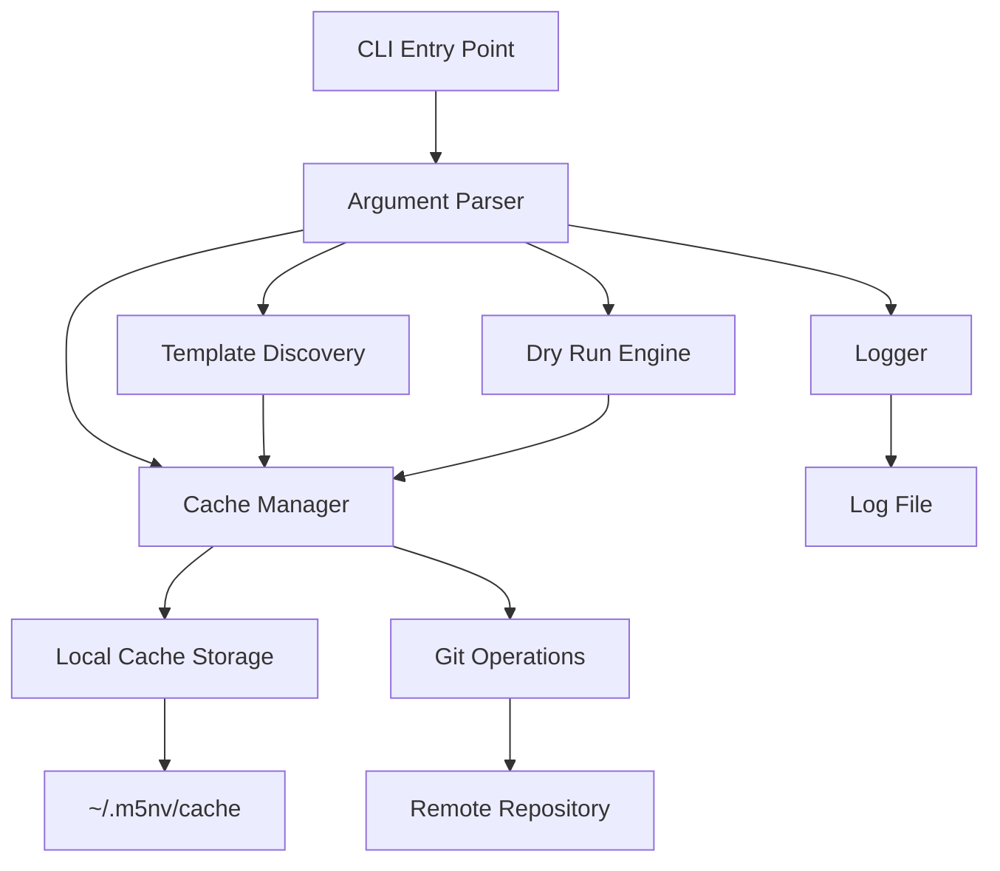

# Design Document

## Overview

This design document outlines the implementation of Phase 1 Core User Experience features for @m5nv/create-scaffold v0.3. The design focuses on four key features: Template Caching, Detailed Logging, Template Discovery, and Dry Run Mode. These features are architected to work together, with template caching serving as the foundational infrastructure that enables fast operation of all other features.

The design maintains the existing zero-dependency architecture while adding new CLI flags and internal modules to support the enhanced functionality.

## Architecture

### High-Level Architecture



### Module Dependencies

- **Cache Manager**: Core infrastructure used by all other features
- **Logger**: Independent module that can be used by any operation
- **Template Discovery**: Depends on Cache Manager for fast repository access
- **Dry Run Engine**: Depends on Cache Manager for preview generation
- **Argument Parser**: Extended to support new CLI flags

## Components and Interfaces

### 1. Cache Manager (`bin/cacheManager.mjs`)

**Purpose**: Manages local caching of template repositories with TTL support.

**Interface**:
```javascript
class CacheManager {
  constructor(cacheDir = '~/.m5nv/cache')
  
  // Core cache operations
  async getCachedRepo(repoUrl, branchName, options = {})
  async refreshCache(repoUrl, branchName)
  async clearExpiredEntries()
  
  // Cache metadata management
  async getCacheMetadata(repoHash)
  async updateCacheMetadata(repoHash, metadata)
  
  // Utility methods
  generateRepoHash(repoUrl, branchName)
  isExpired(metadata, ttlHours = 24)
}
```

**Key Features**:
- Repository hashing for unique cache keys
- TTL-based expiration (default 24 hours)
- Metadata storage for cache management
- Graceful handling of cache corruption
- Support for `--no-cache` bypass

### 2. Logger (`bin/logger.mjs`)

**Purpose**: Provides structured logging with timestamps and operation tracking.

**Interface**:
```javascript
class Logger {
  constructor(logFilePath)
  
  // Core logging methods
  async logOperation(operation, details)
  async logGitClone(repoUrl, branch, destination)
  async logFileCopy(source, destination)
  async logSetupScript(scriptPath, status, output)
  async logError(error, context)
  
  // Utility methods
  formatTimestamp()
  sanitizeLogData(data)
}
```

**Key Features**:
- Timestamped log entries
- Structured logging format
- Error sanitization for security
- Async file operations
- Optional logging (only when `--log-file` provided)

### 3. Template Discovery (`bin/templateDiscovery.mjs`)

**Purpose**: Lists available templates from cached repositories with metadata.

**Interface**:
```javascript
class TemplateDiscovery {
  constructor(cacheManager)
  
  // Discovery methods
  async listTemplates(repoUrl, branchName)
  async getTemplateMetadata(templatePath)
  async parseTemplateJson(templatePath)
  async parseReadmeFrontmatter(templatePath)
  
  // Display methods
  formatTemplateList(templates)
  formatTemplateEntry(template)
}
```

**Key Features**:
- Fast template listing using cached repositories
- Metadata extraction from `template.json` and README frontmatter
- Formatted console output with visual separation
- Fallback descriptions for templates without metadata

### 4. Dry Run Engine (`bin/dryRunEngine.mjs`)

**Purpose**: Previews operations without executing them, using cached repositories.

**Interface**:
```javascript
class DryRunEngine {
  constructor(cacheManager, logger)
  
  // Preview methods
  async previewScaffolding(repoUrl, branchName, templateName, projectDir)
  async previewFileCopy(templatePath, projectDir)
  async previewSetupScript(projectDir)
  
  // Display methods
  displayPreview(operations)
  formatOperation(operation)
}
```

**Key Features**:
- Fast preview generation using cached repositories
- File operation simulation
- Setup script detection without execution
- Clear visual indicators for preview mode

### 5. Enhanced Argument Parser (`bin/argumentParser.mjs`)

**Purpose**: Extended to support new CLI flags for Phase 1 features.

**New CLI Flags**:
- `--log-file <path>`: Enable detailed logging to specified file
- `--list-templates`: Display available templates from repository
- `--dry-run`: Preview operations without executing them
- `--no-cache`: Bypass cache system and clone directly
- `--cache-ttl <hours>`: Override default cache TTL (advanced option)

## Data Models

### Cache Metadata Structure

```javascript
{
  repoUrl: "https://github.com/user/repo.git",
  branchName: "main",
  lastUpdated: "2024-10-26T10:30:00.000Z",
  ttlHours: 24,
  repoHash: "abc123def456",
  size: 1024000,
  templateCount: 5
}
```

### Log Entry Structure

```javascript
{
  timestamp: "2024-10-26T10:30:00.000Z",
  operation: "git_clone",
  details: {
    repoUrl: "https://github.com/user/repo.git",
    branch: "main",
    destination: "/tmp/scaffold-temp-abc123",
    duration: 2500,
    success: true
  }
}
```

### Template Metadata Structure

```javascript
{
  name: "react-typescript",
  description: "React application with TypeScript and modern tooling",
  version: "1.0.0",
  author: "Million Views",
  tags: ["react", "typescript", "vite"],
  requirements: {
    node: ">=18.0.0"
  }
}
```

## Error Handling

### Cache Error Handling

1. **Cache Directory Creation**: Gracefully create cache directory with appropriate permissions
2. **Cache Corruption**: Detect and recover from corrupted cache entries by re-cloning
3. **Disk Space**: Provide clear error messages when cache operations fail due to disk space
4. **Permission Issues**: Handle permission errors with actionable error messages
5. **Network Failures**: Fall back to direct cloning when cache refresh fails

### Logging Error Handling

1. **File Permission**: Gracefully handle log file permission issues
2. **Disk Space**: Detect and report disk space issues for log files
3. **Invalid Paths**: Validate log file paths and provide helpful error messages
4. **Concurrent Access**: Handle multiple process instances writing to same log file

### Discovery Error Handling

1. **Missing Templates**: Handle repositories with no templates gracefully
2. **Malformed Metadata**: Parse template metadata with fallbacks for invalid JSON
3. **Cache Miss**: Automatically populate cache when templates are requested
4. **Network Issues**: Provide clear error messages when repository access fails

### Dry Run Error Handling

1. **Template Access**: Handle missing or inaccessible templates in preview mode
2. **Path Resolution**: Validate project directory paths during preview
3. **Setup Script Detection**: Gracefully handle missing or invalid setup scripts
4. **Cache Dependencies**: Fall back to direct repository access if cache fails

## Testing Strategy

### Unit Testing

1. **Cache Manager Tests**:
   - Repository hashing consistency
   - TTL expiration logic
   - Metadata serialization/deserialization
   - Cache corruption recovery

2. **Logger Tests**:
   - Log entry formatting
   - File writing operations
   - Error sanitization
   - Timestamp generation

3. **Template Discovery Tests**:
   - Template metadata parsing
   - Directory traversal
   - Output formatting
   - Error handling for missing metadata

4. **Dry Run Engine Tests**:
   - Operation preview generation
   - File tree simulation
   - Setup script detection
   - Output formatting

### Integration Testing

1. **End-to-End CLI Tests**:
   - New CLI flags functionality
   - Cache and logging integration
   - Template discovery workflow
   - Dry run complete workflow

2. **Cache Integration Tests**:
   - Cache creation and population
   - TTL-based refresh behavior
   - Multi-repository caching
   - Cache bypass functionality

3. **Cross-Feature Tests**:
   - Logging during cached operations
   - Dry run with template discovery
   - Cache performance with large repositories
   - Error propagation across modules

### Performance Testing

1. **Cache Performance**:
   - Cache hit vs miss performance comparison
   - Large repository caching behavior
   - Concurrent cache access handling
   - Cache cleanup performance

2. **Discovery Performance**:
   - Template listing speed with cached repositories
   - Metadata parsing performance
   - Large template repository handling

3. **Logging Performance**:
   - Log file writing performance impact
   - Large operation logging behavior
   - Concurrent logging performance

## Implementation Considerations

### Backward Compatibility

- All new features are opt-in via CLI flags
- Existing CLI behavior remains unchanged
- No breaking changes to current argument structure
- Setup script interface remains compatible

### Security Considerations

- Cache directory permissions restricted to user only
- Log file sanitization to prevent information disclosure
- Path validation for cache and log file locations
- No sensitive information stored in cache metadata

### Performance Optimizations

- Lazy loading of cache manager and logger
- Async operations throughout for non-blocking behavior
- Efficient repository hashing algorithm
- Minimal memory footprint for cache metadata

### Maintenance Considerations

- Clear separation of concerns between modules
- Comprehensive error handling and logging
- Modular design for easy feature extension
- Consistent coding patterns with existing codebase